<!-- 由 pptx_to_md.py 自 tlm slides.pptx 转换，勿手改本行元信息 -->

## 第 1 页
Enabling Tensor Language Model to Assist in Generating 
High-Performance Tensor Programs for Deep Learning

Yi Zhai1, Sijia Yang2, Keyu Pan3, Renwei Zhang2, Shuo Liu1, Chao Liu2, Zichun Ye2, Jianmin Ji1, Jie Zhao4, Yu Zhang1 and Yanyong Zhang1

1University of Science and Technology of China    2Huawei    3ByteDance    4Hunan University

## 第 2 页
2

Obtaining high-performance (i.e., low-latency) tensor programs with high efficiency (i.e., short compilation time) is critically important for deep learning
Computing hardware architecture is becoming increasingly complex
To better utilize hardware performance, tensor programs need to make many “decisions”
Determining the tiling sizes of loop axes
Setting unroll steps
Choosing computation locations for operators

The challenge of tensor program generation

https://developer-blogs.nvidia.com/wp-content/uploads/2022/11/grace-hopper-superchip-1-e1670969676880.png
https://images.anandtech.com/doci/21116/Apple-M3-chip-series-architecture-231030.jpg
https://www.eetasia.com/wp-content/uploads/sites/2/2020/04/aa25369b-382d-4e5f-a0fa-1a256bccfbe2.png

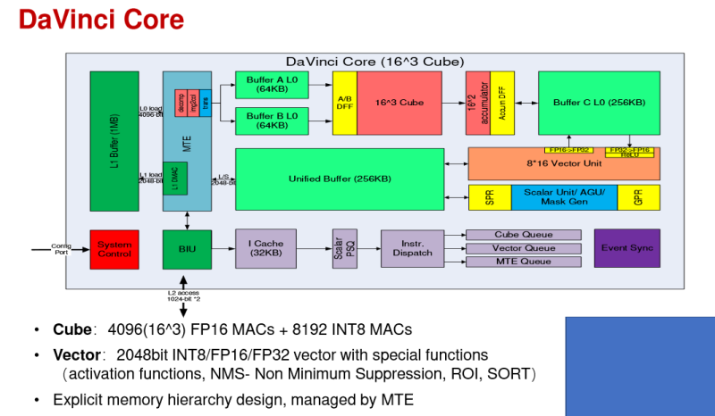
Strategizing on parallelization and vectorization
Deciding thread bindings
…

## 第 3 页
3

Existing approachs

1. Pruning the decision space with heuristic constraints

Performance indicators
(e.g., computing core utilization and/or cache reuse)

Heuristic constraints

Hard to choose suitable performance indicators; a better indicator value does not necessarily lead to better performance.

Sometimes, heuristic constraints prune away high-performance candidates, resulting in poor performance.

High performance 
(e.g., low latency)

design

hard to align perfectly

Decision space

prune

Poor performance

## 第 4 页
4

Existing approachs

2. Using search algorithms + performance cost models to generate tensor programs

Measuring the latency of tensor programs is time-consuming, so performance cost models are used to estimate the latency. 
Performance cost models rely on sound feature engineering.
This approach is not effective in utilizing the large volume of data (i.e., tensor programs and their measured latency) for efficient tensor program generation
Traditional search algorithms were not designed to utilize big data and lacked effective data handling methods.
The performance cost models have a small number of parameters with limited learning ability

## 第 5 页
5

Motivation of TLM

Language models can improve learning capabilities and better utilize data by increasing the number of parameters.

A language model aims to    generate coherent and meaningful text              for a given prompt.

Our task is to                        generate high-performance tensor programs    for given hardware and operator.

We propose to transform the tensor program exploration task into a language model generation task.

## 第 6 页
Overview

Tensor program generation framework

Space builder

Generator

Wrokloads

Subgraphs

Tensor programs

Executables

Graph processer

Code generator

Space builder

Generator

Build an expansive tensor program exploration space

High performance

Develop powerful search capabilities

High efficiency

Tensor 
compiler

## 第 7 页
Overview

Tensor program generation framework

Space builder

Generator

Wrokloads

Subgraphs

Tensor programs

Executables

Graph processer

Code generator

① search space building

③ Large-scale sampling

Subgraphs

Offline dataset

②designingTensor language

④ Pre-training

Supervised 
fine-tuning

⑤ Tensor program generation

⑥ Iterative optimization

Space builder

Generator

Demonstration data

TLM-base

TLM

Tensor program

Offline dataset

Tensor 
compiler

## 第 8 页
1. Search space

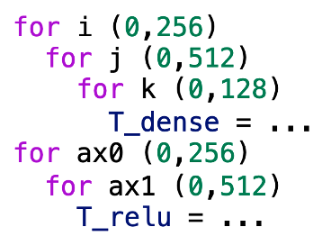
Naive tensor program

Tensor program:

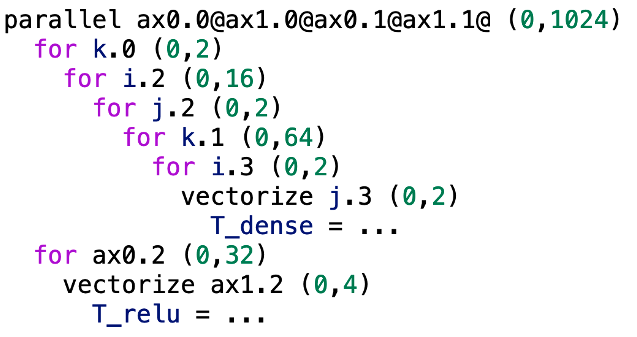
Optimized tensor program

8

Mathematical expression

Hardware

We formally describe the common generation process of optimized tensor programs

## 第 9 页
1. Search space

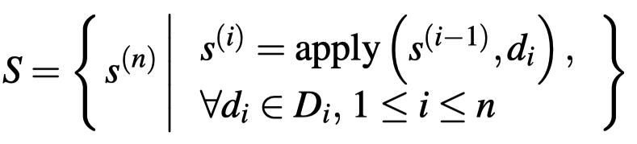
9

Hardware

Tensor program:

We next formally define the overall search space

## 第 10 页
1. Search space

Optimized tensor program

10

## 第 11 页
2. Tensor language

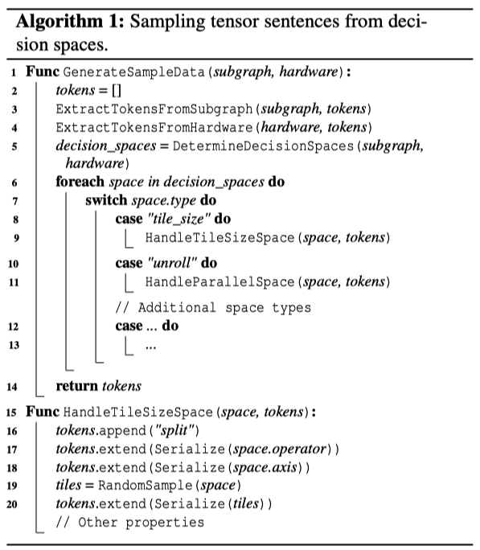
p0 p1 T_matmul_NT p2 T_add 00a059b856ac30ac172b6252254479a6 1024 1024 512 1024 1024 512 1024 512 llvm -keys=cpu -mcpu=core-avx2 -model=i7 4 64 64 0 0 0 0 0 2 SP 2 0 1024 32 1 4 1 SP 2 4 512 8 1 4 1 SP 2 8 1024 1024 1 RE 2 0 4 1 5 8 2 6 9 3 7 FSP 4 0 0 2 FSP 4 3 1 2 RE 4 0 3 1 4 2 5 CA 2 4 3 PPT SPC 2 0 1024 32 1 4 1 SPC 2 4 512 8 1 4 1 SPC 2 8 1024 1024 1 CLS FU 4 0 1 2 3 AN 4 0 3 PRS 2 PR 2 0 auto_unroll_max_step$0 VECS

fused nn dense add fast tanh float32 4 512 float32 512 512 float32 1 512 float32 4 512 llvm -keys=cpu -mcpu=core-avx2 -model=i7 -num-cores=4 GetBlock T_matmul_NT main b0 GetBlock T_add main b1 GetBlock T_minimum main b2 GetBlock T_maximum main b3 GetBlock root main b4 ComputeInline b3 ComputeInline b2 ComputeInline b1 Annotate b0 \"SSRSRS\" meta_schedule.tiling_structure GetLoops b0 l5 l6 l7 SamplePerfectTile l5 4 64 v8 v9 v10 v11 Split l5 v8 v9 v10 v11 1 l12 l13 l14 l15 SamplePerfectTile l6 4 64 v16 v17 v18 v19 Split l6 v16 v17 v18 v19 1 l20 l21 l22 l23 SamplePerfectTile l7 2 64 v24 v25 Split l7 v24 v25 1 l26 l27 Reorder l12 l20 l13 l21 l26 l14 l22 l27 l15 l23 GetConsumers b0 b28 ReverseComputeAt b28 l20 1 -1 Annotate b4 1 meta_schedule.parallel Annotate b4 64 meta_schedule.vectorize SampleCategorical 0 16 64 512 0.25 0.25 0.25 0.25 v29 Annotate b4 v29 meta_schedule.unroll_explicit EnterPostproc 10 1 1 1 1 12 1 1 1 1 14 1 1 21 1 PPT 10 1 1 4 1 12 8 4 2 8 14 512 1 21 0 Annotate b4 2 meta_schedule.parallel

11

We design our natural language like tensor language. Our tensor language sentence consists of three components: (1) input subgraph, (2) hardware specifications, (3) decision paths. The token of each component of a sentence is flexible yet consistent.

## 第 12 页
3. Large-scale random sampling

12

## 第 13 页
4. Pre-training

13

TLM adopts the architecture of GPT-2 Small
Approximately 100 million parameters. TLM is composed of 12 Transformer layers, each featuring 12 attention heads and 768 hidden units.

After pre-training, TLM can generate valid tensor language sentences

Large-scale dataset

TLM

sampling

pre-training

## 第 14 页
5. Generating tensor programs

We first generate tensor language sentences, like how the language model generates sentences. 
The language model probabilistically sample the next token to ensure the generated sentence is "coherent and meaningful ".  
When generating the next token (i.e., the current decision), TLM combines the knowledge learned and the decisions made to probabilistically sample the current decision.

What is a language model? A language model...

LM

["What", "is", "a", "language", "model", "?"]

"A"

[..., "is", "a", "languange", "model", "?", "A"]

[..., "languange", "model", "?", "A", "language"]

"model"

⋮

[..., "model", "?", "A", "language", "model" ...,]

"</s>"

["What", "is", "a", "language", "model", "?", "A", "language", "model" …, "</s>"]

⑤

③

④

⑥

⑦

⑧

Input

Next token

Prompt + Response

What is a language model?

["What", "is", "a", "language", "model", "?"]

②

①

Prompt

... split i=1024 to i.0=32 i.1=1 i.2=4 split ...

TLM

[…, "split", "i=1024", "to"]

"i.0=32"

[…, "i=1024", "to", "i.0=32"]

"i.1=1"

[…, "to", "i.0=32", "i.1=1"]

"i.2=4"

[…, "i.2=4", "split", "j=512", "to"]

"j.0=8"

[…, "j=512", "to", "j.0=8"]

"j.1=1"

⋮

[…, "to", "j.0=8", "j.1=1", …]

"</s>"

[…, "split", "i=1024", "to", "i.0=32", "i.1=1", "i.2=4", "split", …, "</s>"]

①

②

③

④

⑤

⑥

⑦

⑧

Input

Next token

Prompt + Response

"language"

## 第 15 页
5. Generating tensor programs

15

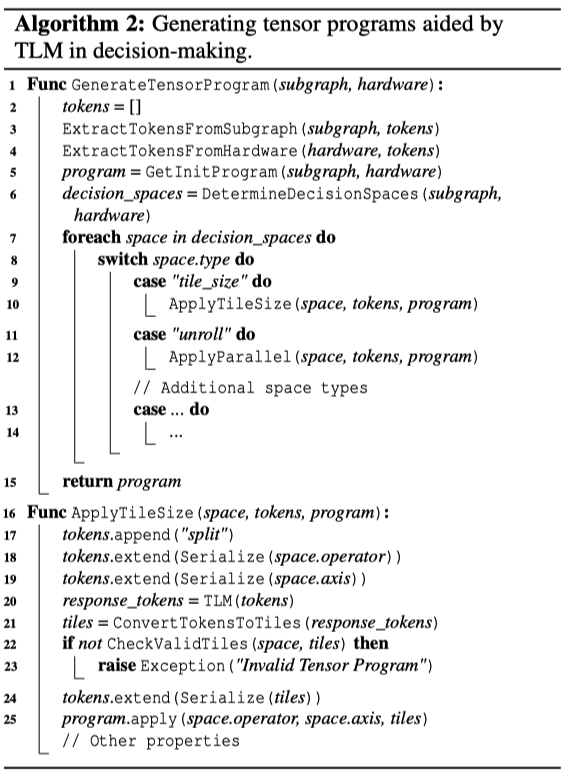
We next generate tensor programs:

TLM extracts tokens from sentences, converts them to decisions, and applies them to the input subgragh to generate the tensor program.

This process has the reverse flow of the previous sentence token generation step.

## 第 16 页
5. Generating tensor programs

16

How do language models generate valid tensor programs?        		✅
How do language models generate high-performance tensor programs?	❓
Using high-performance (i.e., low latency) tensor language sentences as demonstration data to perform supervised fine-tuning (SFT)!
The purpose of SFT of a language model with demonstration data is to achieve that the model’s responses to prompts align with the human intentions reflected in the demonstration data.
But, where does the demonstration data come from?

## 第 17 页
6. Iterative Optimization

17

In each iteration, we train our TLM model in a slightly different fashion compared to the language model training:

We substitute the reward model (RM) with actual tensor program measurement
A tensor sentence can be converted into a tensor program, allowing its execution latency to be directly measured on hardware

We employ iterative SFT instead of reinforcement learning (RL) 
The reinforcement learning convergence process is unstable

1 × pre-training + 1 × SFT + n × (RM + RL)

1 × pre-training + n × (measurement + SFT)

Language model training

TLM training

## 第 18 页
6. Iterative Optimization

18

Prompts

TLM

TLM-base

Sentences

Demonstration data

Database

Candidates

Measure in parallel

Records

SFT

To be measured

Measured

TLM can generate better data iteration by iteration.
The combination of inheritance and mutation may potentially generate higher quality data, aligning with the design philosophy of genetic algorithms.

The latency of the demonstration data will converge.
 
Mathematically speaking, a monotonic and bounded limit results in convergence.

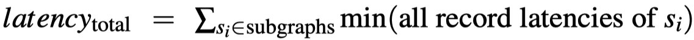
How do language models generate valid tensor programs?        	              ✅
How do language models generate high-performance tensor programs?	 ✅

The core of the iterative optimization is to use the best subset of the data generated by TLM (a.k.a, the demonstration data) to fine-tune TLM.

## 第 19 页
Evaluation

19

1. Convergence Behavior of Demonstration Data

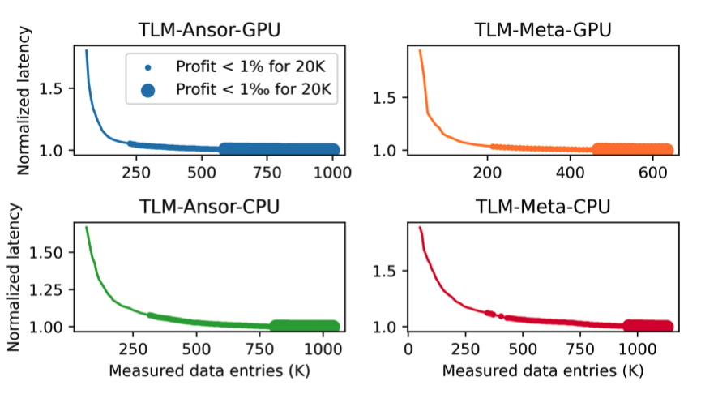
Inducing convergence across all 126 workloads calls for approximately 200K tensor program measurements on the GPU and about 300K on the CPU.

TLM involves a data volume an order of magnitude smaller compared to TenSet and TLP, which utilize approximately 8.6M measurements.

## 第 20 页
Evaluation

20

2. Subgraph Benchmark

With 10 measurements, TLM can achieve 103% and 95% of the performance of Ansor and MetaSchedule after 10K measurements

TLM consistently achieves acceleration relative to Ansor [osdi20] and MetaSchedule [NeurIPS23] with equal measurement times.

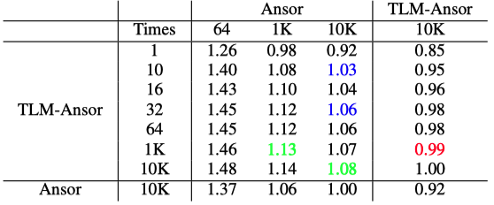

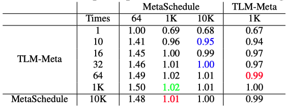

## 第 21 页
Evaluation

21

3. End-to-End Workload Benchmark

Under a limited budget, TLM’s performance matches that of Ansor/MetaSchedule yet compiles 61× faster -> high efficiency

In ample exploration times, TLM’s compilation duration is consistent with Ansor and MetaSchedule, delivering a performance boost of 1.08× and 1.04×, respectively.

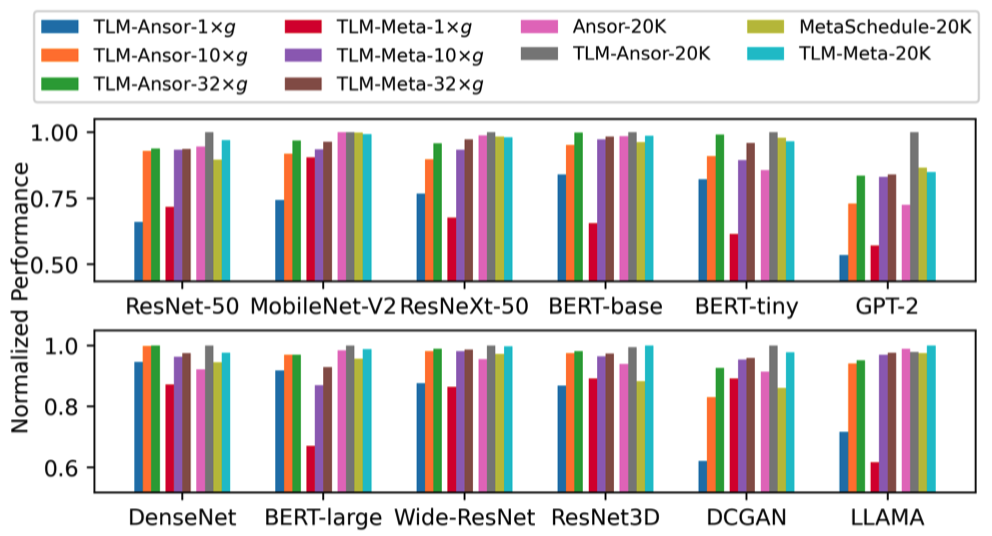

## 第 22 页
Evaluation

22

3. End-to-End Workload Benchmark

While its compilation time aligns with Roller[osdi22], its performance is 2.25× better.

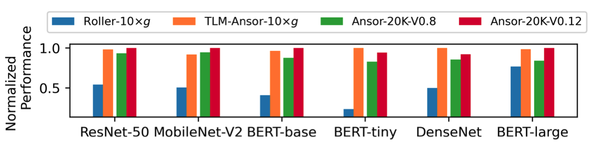
Performance Speedup
TLM vs. AKG	                1.69X
TLM vs. AKG-TBE	   1.98X

TLM has been implemented in actual systems and is now used in production.

## 第 23 页
23

Summary

Code available at https://github.com/zhaiyi000/tlm

We design the language model-friendly tensor language to represent tensor programs, leveraging the learning capability of language models to generate high-performance tensor programs efficiently.

We develop a tensor language model that combines knowledge from offline learning and previously made decisions to probabilistically sample the best decision in the current decision space, enabling more effective space exploration.
